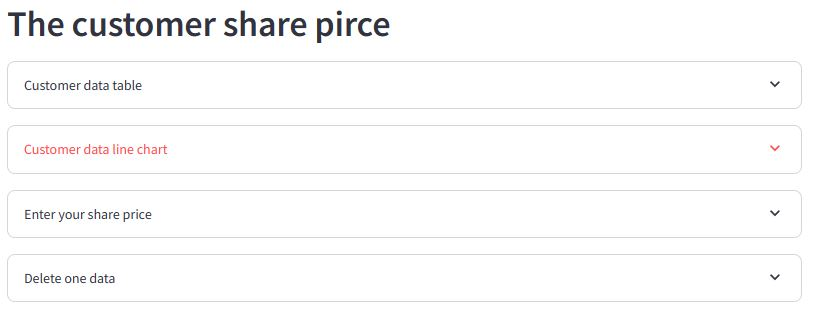
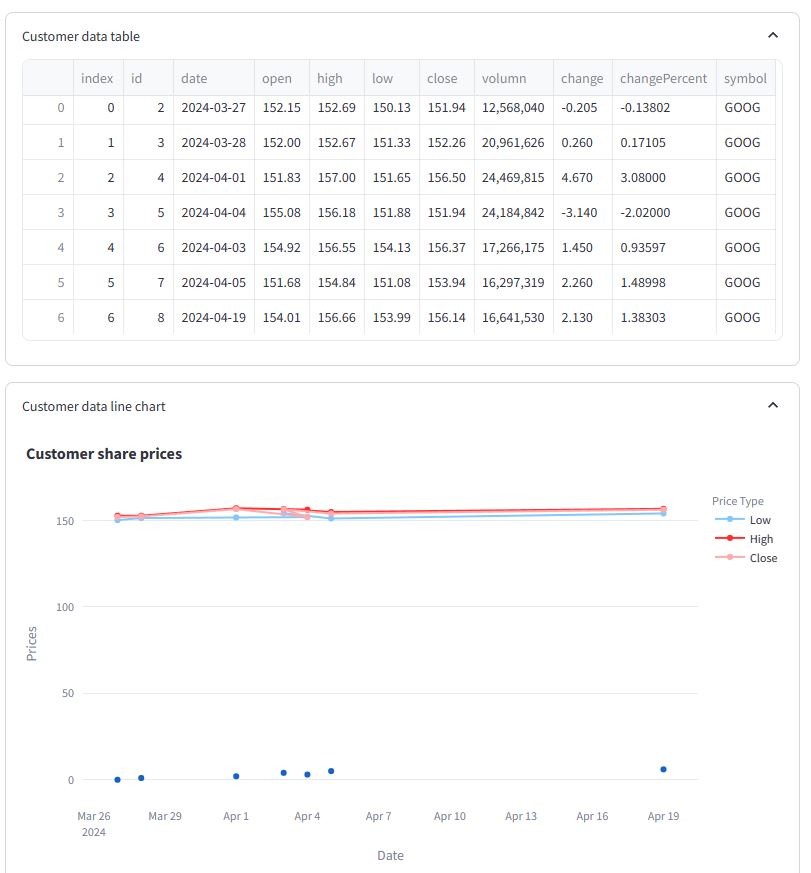
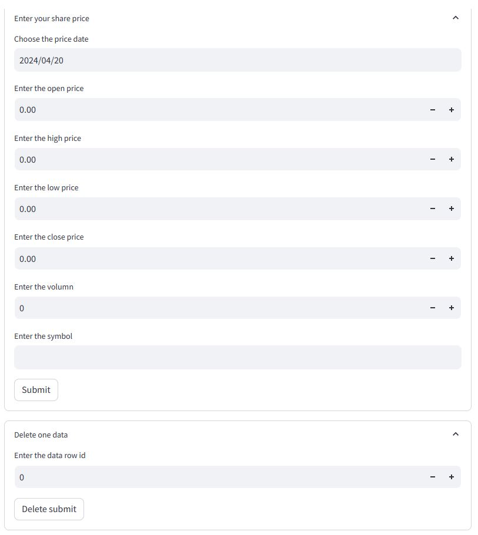

# DataAna
Learning of data analysis. Using financial dataset from [Finacial Modeling Prep | FMP](https://site.financialmodelingprep.com/) to build data dashboard to vistualize share market prices. Scraping S&P500 Constituents list from wikipedia [website](https://en.wikipedia.org/wiki/List_of_S%26P_500_companies).
## Run the code
`streamlit run dataDB_main.py`

The example the interface:

## Operatio of the data API to build customer data
These functions connect to data API from [DataAPI](https://github.com/ych2tj/DataAPI). The Operation includes four expanders:

Two expanders display the data table and scatter charts for similar symbol.

The other two expanders operate the API to input and delete data.

## Acknowledgement
The streamlit tutorial is in [here](https://www.youtube.com/watch?v=7yAw1nPareM)
Source code and the CSV data is under the video caption.

`streamlit run dataDB_learn.py`
