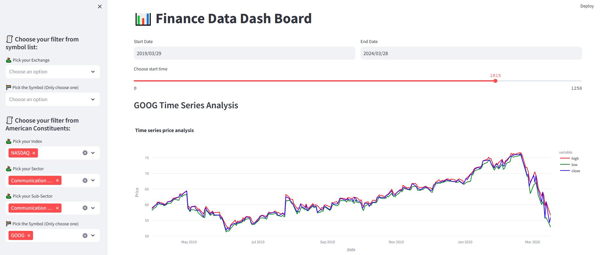

# DataAna
Learning of data analysis. Using financial dataset from [Finacial Modeling Prep | FMP](https://site.financialmodelingprep.com/) to build data dashboard to vistualize share market prices. Scraping S&P500 Constituents list from wikipedia [website](https://en.wikipedia.org/wiki/List_of_S%26P_500_companies)
## Run the code
`streamlit run dataDB_main.py`

The example the interface:

## Learn the streamlit from youtube
The streamlit tutorial is in [here](https://www.youtube.com/watch?v=7yAw1nPareM)
Source code and the CSV data is under the video caption
`streamlit run dataDB_learn.py`
